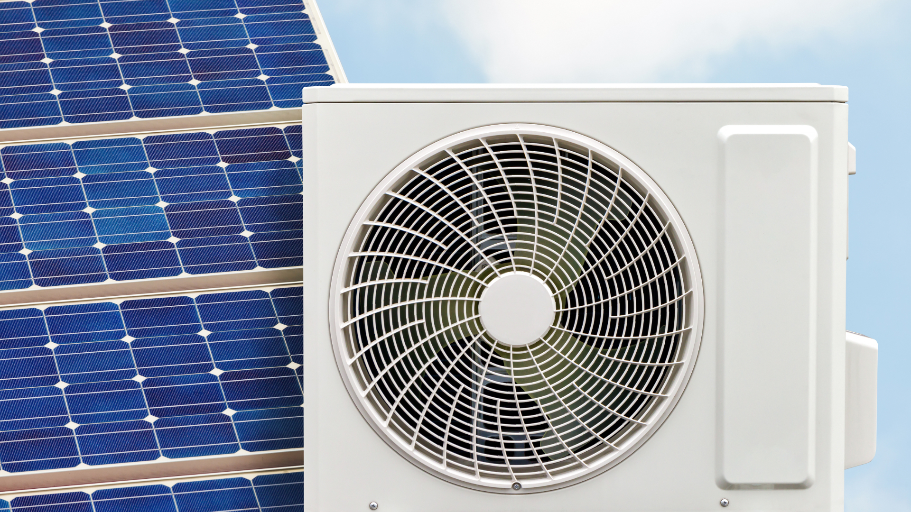

Maker Media GmbH

***

# Überschuss-Hack für Wärmepumpe

**Wohin mit dem Photovoltaik-Überschuss im Sommer? Natürlich in den Warmwasserspeicher –
vollautomatisch mithilfe der Open-Source-Projekte evcc, ioBroker und einem Raspberry Pi.**

Ergänzend zum Artikel in der Make 3/25 gibt es hier die Projektdateien und Skripts zum Herunterladen.

Der vollständige Artikel zum Projekt steht in der **[Make-Ausgabe 3/25](https://www.heise.de/select/make/2025/3)**.
